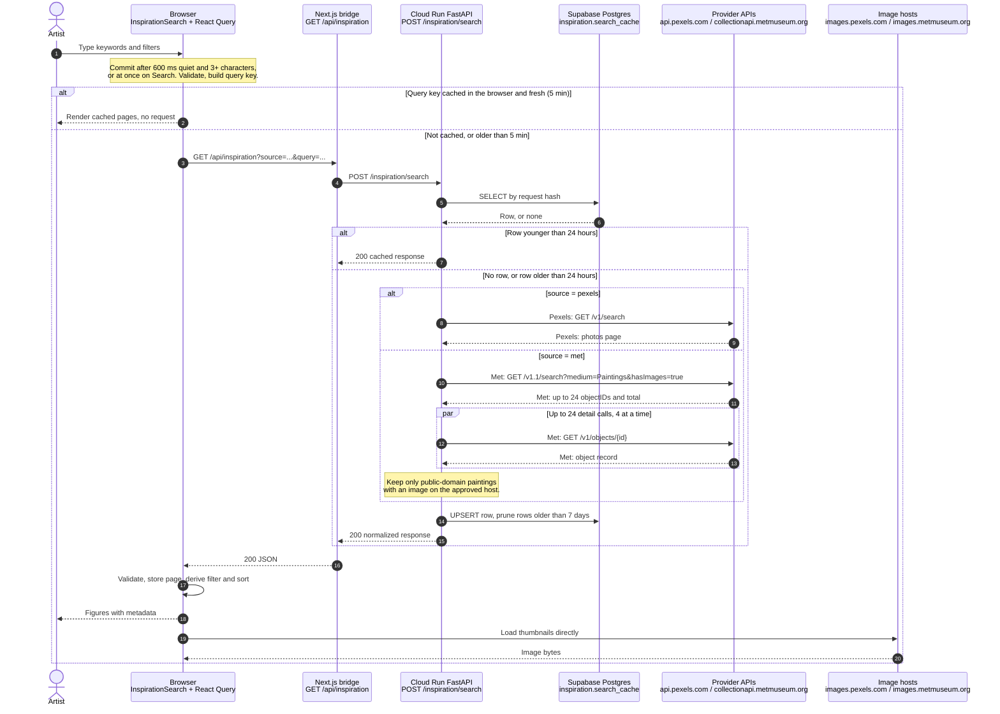
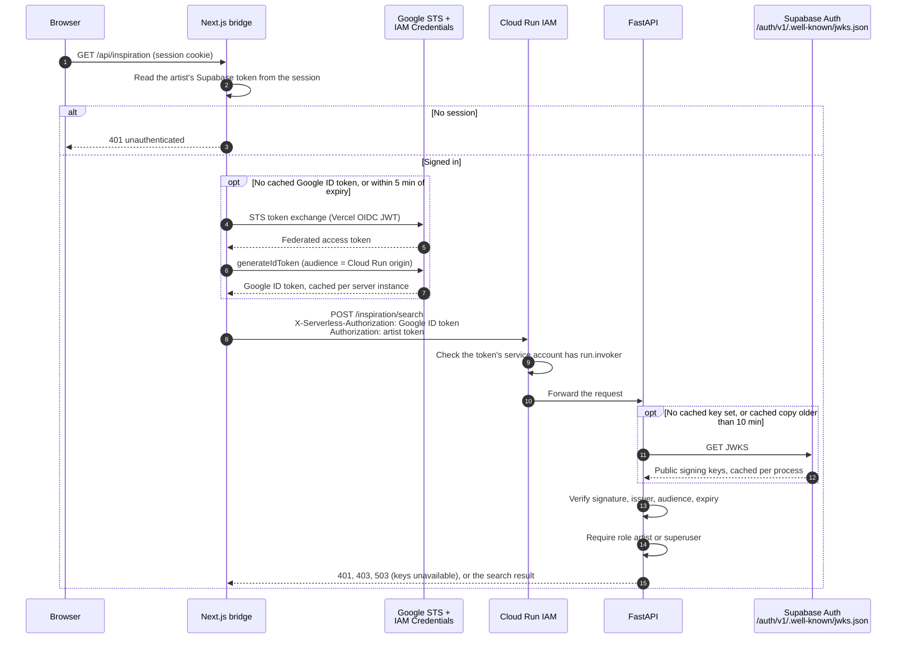
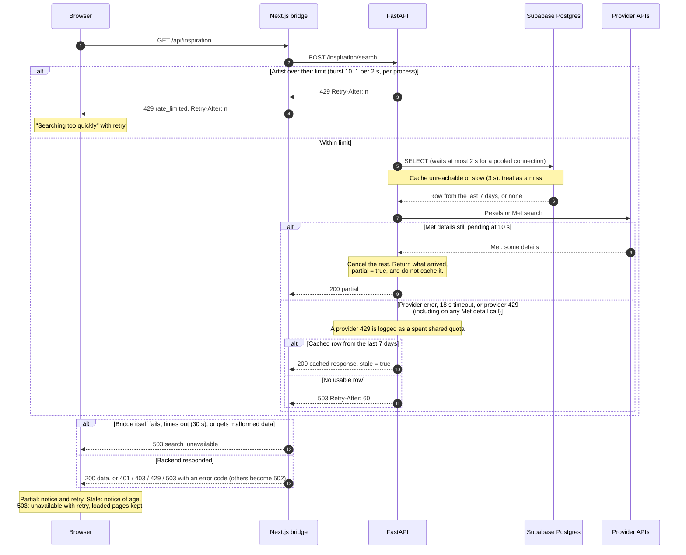

# Get Inspired: frontend system design practice

The Studio route is `/[locale]/get-inspired`. Home contains a link; no Studio redesign
is required. This phase displays images and available creator, medium, and date metadata.
It does not start projects, open an insights view, or generate imagery.

## Trace one search

```text
Keystroke → draft → 600 ms debounce (terms of 3+ characters) → validated request
  → React Query key → GET /api/inspiration → authenticated Next.js bridge
  → cached Cloud Run identity → POST /inspiration/search → per-artist rate limit
  → shared Supabase Postgres cache (pooled connections)
  → Pexels search OR Met search + bounded object-detail requests
  → normalized result → query cache → derived filter/sort → responsive figures
```

Image bytes load directly from the two approved image hosts. Provider APIs are reached
only by Python. Browser `connect-src` remains `self`; API keys and user access tokens
never enter the browser. CSP allows images from `images.pexels.com` and
`images.metmuseum.org`, with no arbitrary image proxy.

## Sequence of one search

Three diagrams follow one search. The first is the end-to-end path with no auth or
error detail. The second adds how each hop proves who is calling. The third covers
rate limits, outages, and partial results. Pexels and the Met share one lane; each
call is prefixed with its provider. The Met branch is the expensive one: one search
call plus up to 24 detail calls per page.

Each diagram is followed by a code map from its step numbers to the code that runs
them. Paths are abbreviated with these prefixes:

| Prefix | Directory |
| --- | --- |
| `studio/` | `apps/studio/src/` |
| `agent/` | `python/services/agent/src/artloupe/agent/` |
| `py-auth/` | `python/libs/auth/src/artloupe/auth/` |

### End to end



| Steps | Code | What it does |
| --- | --- | --- |
| 1 | `studio/components/inspiration/use-search-input.ts` → `useSearchInput` | Holds the draft, debounces, and commits. |
| 1 | `studio/components/inspiration/inspiration-search.tsx` → `worthAutoSearch` | Applies the three-character rule to automatic commits. |
| 1 | `packages/schemas/src/inspiration.ts` → `inspirationRequestSchema` | Validates and normalizes the request in the browser. |
| 2 | `studio/components/inspiration/inspiration-page.tsx` → `QueryClient` options | Sets the 5-minute freshness and 30-minute retention. |
| 2–3 | `studio/components/inspiration/inspiration-search.tsx` → `useInfiniteQuery` | Owns the query key, pagination, and refetch. |
| 3, 17 | `studio/lib/inspiration/search.ts` → `fetchInspiration` | Calls the bridge, then validates the response, page, and source. |
| 4 | `studio/app/api/inspiration/route.ts` → `GET` | Validates again, then forwards to FastAPI. |
| 4 | `agent/inspiration_routes.py` → `search` | The FastAPI endpoint. |
| 4–15 | `agent/inspiration_models.py` → `SearchRequest`, `SearchResponse` | Validates the request and the response contract in Python. |
| 5–7, 14 | `agent/inspiration_cache.py` → `cached_search` | Decides fresh hit, provider call, cache write, or stale. |
| 5–6, 14 | `agent/inspiration_cache.py` → `SharedCache`, `_get_pool`, `cache_key` | Reads and writes rows through the connection pool. |
| 5–6, 14 | `supabase/migrations/20261005120000_create_inspiration_cache.sql` | Defines the table, the restricted role, and RLS. |
| 8–13 | `agent/inspiration_providers.py` → `search_provider` | Picks the provider and applies the 18-second deadline. |
| 8–9 | `agent/inspiration_providers.py` → `search_pexels` | Calls Pexels and normalizes the photos. |
| 10–13 | `agent/inspiration_providers.py` → `search_met` | Calls the Met search, then the detail fan-out. |
| 13 | `agent/inspiration_providers.py` → `painting`, `safe_url` | Filters for public-domain paintings on approved hosts. |
| 8–13 | `agent/inspiration_providers.py` → `get_json` | Makes every provider HTTP call, with a 5-second timeout. |
| 16 | `studio/app/api/inspiration/route.ts` → `inspirationResponseSchema` | Validates the backend response before returning it. |
| 17 | `studio/lib/inspiration/results.ts` → `visibleResults` | Removes duplicates, then filters and sorts loaded results. |
| 18 | `studio/components/inspiration/inspiration-search.tsx` → `InspirationSearch` | Renders the form, notices, and result grid. |
| 18–20 | `packages/fascia/src/components/blocks/image-metadata-card.tsx` → `ImageMetadataCard` | Renders each figure and handles a broken image. |
| 19–20 | `apps/studio/next.config.ts` → CSP `img-src` | Allows only the two image hosts. |

### Authentication and service identity

Two identities travel on every backend request. The Google ID token says the call
comes from the Studio deployment. The artist's Supabase token says which artist is
asking. Neither check needs a stored credential: the bridge proves its identity through
Vercel's OIDC token, and FastAPI verifies the artist against Supabase's published keys.



| Steps | Code | What it does |
| --- | --- | --- |
| 1 | `studio/proxy.ts` | Gates every `/api` route before the handler runs. |
| 2–3 | `packages/auth/src/server.ts` → `getAccessToken` | Reads the artist's Supabase token from the session. |
| 2–3 | `studio/app/api/inspiration/route.ts` → `GET` | Returns 401 when there is no token. |
| 4–8 | `studio/lib/inspiration/cloud-run.ts` → `cloudRunHeaders` | Checks the backend origin and reuses the cached ID token. |
| 4–7 | `studio/lib/inspiration/cloud-run.ts` → `mintIdToken` | Runs the STS exchange and `generateIdToken`. |
| 4 | `@vercel/oidc` → `getVercelOidcToken` | Supplies the Vercel OIDC JWT for the exchange. |
| 4–7 | `studio/env.ts` → `GCP_WIF_AUDIENCE`, `GCP_SERVICE_ACCOUNT` | Configure the federation. |
| 9–10 | No code in this repo | Cloud Run IAM configuration; see `get-inspired-deployment.md`. |
| 11–12 | `py-auth/tokens.py` → `_load_key_set` | Fetches the JWKS and caches it per process. |
| 11–12 | `py-auth/config.py` → `jwks_url`, `artloupe_jwks_cache_seconds` | Set the JWKS address and its 10-minute cache. |
| 13 | `py-auth/tokens.py` → `verify_access_token` | Verifies the signature, issuer, audience, and expiry. |
| 13 | `py-auth/dependencies.py` → `require_token` | Turns verification failures into 401 or 503. |
| 14 | `py-auth/dependencies.py` → `require_role` | Returns 403 for a role other than artist or superuser. |
| 14 | `agent/inspiration_routes.py` → `Searcher` | Applies `require_role` to the search endpoint. |

### Errors and degraded results

Each failure has its own response, so the artist can tell "slow down" from "try later".
A 429 from the backend always means this artist's own limit. A provider's 429 means the
shared quota is spent, so the backend reports 503 instead.



| Steps | Code | What it does |
| --- | --- | --- |
| 3 | `agent/inspiration_rate_limit.py` → `RateLimiter.acquire` | Runs the per-artist token bucket and computes `Retry-After`. |
| 3 | `agent/inspiration_routes.py` → `search` | Raises 429 with that wait. |
| 4, 12–13 | `studio/app/api/inspiration/route.ts` → `GET` | Maps statuses, passes `Retry-After` through, and returns 503 on its own failures. |
| 5–6 | `agent/inspiration_cache.py` → `SharedCache._operation` | Applies the 3-second limit and turns any cache failure into a miss. |
| 5–6 | `agent/inspiration_cache.py` → `POOL_WAIT_SECONDS` | Sets the 2-second wait for a pooled connection. |
| 7–8 | `agent/inspiration_providers.py` → `search_met`, `MET_DETAIL_BUDGET_SECONDS` | Cancels pending detail calls at 10 seconds and marks the page partial. A detail 429 cancels the rest and fails the page as an outage. |
| 7 | `agent/inspiration_providers.py` → `get_json` | Logs a provider 429 and raises `ProviderUnavailable`. |
| 7 | `agent/inspiration_providers.py` → `search_provider` | Applies the 18-second deadline and wraps errors as `ProviderUnavailable`. |
| 9–11 | `agent/inspiration_cache.py` → `cached_search` | Skips caching partial pages and falls back to stale rows. |
| 10–11 | `agent/inspiration_routes.py` → `search` | Turns `ProviderUnavailable` into 503 with `Retry-After: 60`. |
| 12–13 | `studio/lib/inspiration/search.ts` → `SearchError` | Carries the status into React Query. |
| 12–13 | `studio/components/inspiration/inspiration-search.tsx` → `errors`, notices | Chooses the message, retry, and partial or stale notices. |
| 12–13 | `apps/studio/messages/en.json` → `inspiration.*` | Holds the copy for each outcome. |

## Pieces to remember

| Piece | Code | Why it exists |
| --- | --- | --- |
| Draft versus committed input | `use-search-input.ts` | Typing is immediate; requests wait 600 ms, and only for terms of three or more characters. Submit commits immediately, whatever the length. While a short edit is held back, the status says which term the loaded results belong to. Source changes clear incompatible filters and commit immediately. |
| Timer cleanup | `use-search-input.ts` | Every keystroke cancels the previous timer; unmount cancels the final one. |
| Validation and normalization | `packages/schemas/src/inspiration.ts` | Trim whitespace, bound inputs and pages, reject filters for the wrong provider, require ordered date pairs. Python validates again at its own boundary. |
| Query key | `inspiration-search.tsx` | Source and request filters identify server data. The same normalized search reuses its cache. |
| Cancellation | `search.ts` | React Query supplies an AbortSignal. Obsolete fetches are cancelled and cannot overwrite a newer query. |
| Infinite query | `inspiration-search.tsx` | Explicit Load more keeps pagination under user control. A changed query starts at page one. A failed next page retains prior pages. |
| Server versus view state | `results.ts` | Query pages are server state; title/creator filtering and sorting are derived view state. Local controls do not make requests. |
| Immutable sorting | `results.ts` | `toSorted` leaves cached arrays intact; unknown dates sort last in either direction. Duplicate IDs across pages are removed. |
| Two cache layers | Page QueryClient and `inspiration_cache.py` | Browser cache improves revisits; shared database cache avoids repeated provider calls across Cloud Run instances. |
| Per-artist rate limit | `inspiration_rate_limit.py` | A token bucket per verified user protects the provider quota that every artist shares. |
| Connection pool | `inspiration_cache.py` | One small pool per process reuses database connections instead of connecting per operation. |
| Identity token cache | `cloud-run.ts` | One Google ID token per server instance is reused until shortly before it expires. |
| Detail deadline | `inspiration_providers.py` | A slow Met batch returns the details that arrived, marked partial, instead of failing whole. |
| Layout | fascia `ImageMetadataCard` | Fixed image space limits layout shift; `object-contain` preserves the whole painting. Metadata survives a broken image. |
| Accessibility | fascia primitives and Playwright | Native selects, associated labels, visible focus, 44px controls, polite status, semantic figures, and error announcements. |

Start with this recall exercise: name each state variable, classify it as draft input,
server state, or derived view state, then explain which changes cause a network request.
Next explain what happens when the user types "tree", changes it to "flowers", and the
first response arrives last. Finally explain an outage with and without a cached result.
Then explain why typing "sunflower" costs one provider request rather than four, and
what an artist sees when they search too quickly versus when the provider quota is spent.

## Provider semantics

Pexels provides orientation, minimum size, and color filters. Its documented photo search
has no include/exclude-people parameter and no sorting parameter, so neither is invented.
Pexels provides photographer and description metadata, not painting medium or creation date.
Provider attribution and photographer/photo links are displayed now as requested by its
API guidelines; future image-click navigation remains deferred.

Met requests `medium=Paintings` and `hasImages=true` using paginated `/v1.1/search`.
Each detail record must additionally be classified as Paintings, be public domain, and
have an HTTPS image URL on the approved Met image host. A later broken image is handled
in the card; a nonempty URL cannot guarantee a host will remain available.

With only an artist, Met's artist-or-culture search narrows candidates; returned artist
names must also contain the requested name, case-insensitively. With keywords and an
artist, keyword search selects candidates and the artist check narrows each batch.
The field is a substring match, not an authoritative artist identifier. Department is
not exposed. Date ranges and highlights are provider request filters.

Both sources request 24 candidates per page. Met batches can contain fewer displayable
paintings, even zero, after eligibility/artist checks. Load more continues where available;
there is no misleading total claiming all provider candidates are displayable paintings.
Met limits search to its first 10,000 candidates. Sorting/filtering explicitly applies
only to loaded images, not the entire upstream collection.

## Failure and cache behavior

Search results are fresh for 24 hours and may be served stale for seven days when a
provider is unavailable. Cache keys include every validated request field and a contract
version. Old keys are pruned on writes. Partial Met batches are not cached, so transient
detail failures do not become a fresh cache entry. Successful empty searches are cached.

The browser cache is fresh for five minutes and retained for thirty minutes after it
becomes inactive. It is scoped to the mounted page, with no localStorage persistence or
server-module singleton. Focus does not automatically spend provider quota.

Cache operations borrow connections from a pool of at most four per process. The pool
opens lazily on the first search and sets the restricted database role once per
connection. An operation waits at most two seconds for a connection, then treats the
cache as a miss. Before the pool, each search opened a new TLS connection to Supabase
for its read, and another for its write on a miss.

## Latency budget

Timeouts nest so that each layer gives up before the layer above it:

| Layer | Budget | What happens at the limit |
| --- | --- | --- |
| One provider call | 5 s | The call fails; a Met detail failure only makes the page partial. |
| Met detail batch | 10 s | Details still pending are cancelled; the page returns as partial. |
| Provider search | 18 s | The search fails over to stale cache, or reports unavailable. |
| Cache operation | 3 s | Treated as a miss (read) or skipped (write). |
| Backend search | 22 s | Includes waiting for one of four search slots per process. |
| Next.js bridge | 30 s | The artist sees "unavailable" with a retry. |

The Met detail budget exists because 24 detail calls run four at a time. At five seconds
per call, a slow Met could need about thirty seconds for a full batch. Before the budget,
that overran the eighteen-second search deadline and discarded every detail that had
arrived. Now the search call plus the detail budget fit inside the deadline, and a slow
Met yields a partial page. Partial pages are not cached, so the next search tries again.

## Protecting the shared provider quota

Every artist's searches spend one Pexels API key. The Met has no key, but each Met page
costs one search call plus up to 24 detail calls. Three mechanisms keep one artist from
spending the shared budget:

- **Fewer automatic requests.** Typing searches only after 600 ms of quiet, and only once
  each term has at least three characters. Shorter terms still search on submit. Typing
  "sunflower" with pauses therefore no longer searches "sun", "sunfl", and "sunflow".
  When an edit is too short to search, the loaded results stay, and the status names
  the term they belong to and asks the artist to press Search.
- **A per-artist limit.** FastAPI gives each verified user a burst of 10 searches that
  refills at one search every two seconds. Over the limit, the backend returns 429 with
  the exact `Retry-After`, and the bridge passes that wait through. The limit counts cache
  hits too, which keeps it simple at the cost of some strictness.
- **Two kinds of "too many".** A 429 now means only that this artist searched too quickly.
  When a provider returns 429, its quota is spent for everyone. The backend logs a warning
  and reports 503, so the artist sees "temporarily unavailable" and stale cache still
  applies.

The limiter's state is in memory and per process. Each Cloud Run instance counts
separately, so the effective limit scales with the instance count. Memory is bounded at
10,000 tracked artists per process by forgetting the least recently active; a forgotten
artist starts again with a full burst. That bounds ordinary
over-use, not a determined caller. A limit enforced across instances would need shared
state, such as a database counter. Cache misses can also race across instances, so set
Cloud Run's maximum instances with the provider quota in mind.

## Service identity

The bridge reaches Cloud Run with a Google ID token minted through workload identity
federation. Minting costs two Google calls (STS, then IAM Credentials). The token
identifies the Studio deployment, not the artist, so one token is shared by every request
on a server instance. It is cached until five minutes before its `exp` claim, and an
in-flight mint is shared by concurrent requests. A failed mint is never cached. The mint
uses its own ten-second timeout rather than the artist's request signal, so one artist
cancelling cannot fail a mint that others are waiting on.

Missing configuration, malformed provider responses, network failures, the artist's own
rate limit, a spent provider quota, expired sessions, empty results, partial metadata, and broken images have distinct behavior.
A provider outage uses stale data if available. An unavailable cache degrades to a provider
request. No upstream error bodies, credentials, DSNs, or queries are logged by this feature.
The frontend offers retry, preserves already loaded pages after pagination failure, and
shows partial/stale notices. An expired session asks the artist to sign in again.

## Verify it

Use Node 24 (the repository's current test tools require a modern Node runtime).
The installed Vite/Rolldown pair currently fails while bundling Vitest config; the
`--configLoader runner` option avoids that dependency issue without changing the feature.

```sh
pnpm --filter @artloupe/studio exec vitest run --configLoader runner src/components/inspiration src/lib/inspiration src/app/api/inspiration
pnpm --filter @artloupe/fascia exec vitest run --configLoader runner src/components/blocks/image-metadata-card.test.tsx
pnpm --filter @artloupe/schemas exec vitest run --configLoader runner src/inspiration.test.ts
uv run --directory python pytest services/agent/tests/test_inspiration.py services/agent/tests/test_service.py
pnpm --filter @artloupe/studio typecheck
PLAYWRIGHT_PORT=3101 pnpm --filter @artloupe/studio exec playwright test e2e/inspiration.spec.ts
```

An explicit `PLAYWRIGHT_PORT` starts an isolated test server instead of reusing a running
development server. Playwright stubs the same-origin API and image requests, never calls the live providers,
and tests the production UI with the existing demo-auth harness. Backend and bridge unit
tests cover the boundaries hidden by those browser stubs. The shared parity fixture is
loaded by both TypeScript and Python tests.

Axe audits use WCAG 2 A/AA, 2.1 AA and 2.2 AA tags. Keyboard traversal, result filtering,
error recovery and 320px reflow are asserted separately. Automated axe checks alone cannot
certify every WCAG criterion; review screen-reader announcements and focus behavior when
changing interaction design.

## Sources

- [Pexels API documentation](https://www.pexels.com/api/documentation/)
- [Met Collection API documentation](https://metmuseum.github.io/)
- [Vercel to Google Cloud federation](https://vercel.com/docs/oidc/gcp)
- [Google STS token exchange](https://cloud.google.com/iam/docs/reference/sts/rest/v1/TopLevel/token)
- [Cloud Run service authentication](https://cloud.google.com/run/docs/authenticating/service-to-service)
